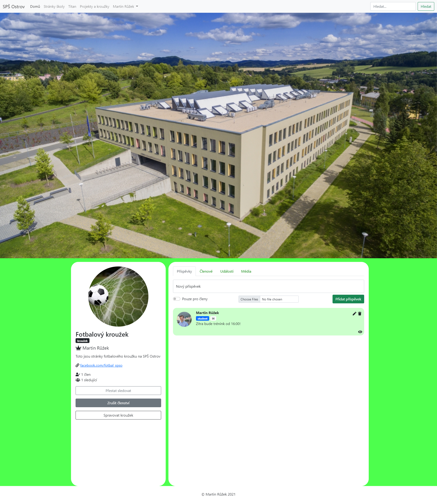

## O projektu

Tato aplikace vznikla jako moje dlouhodobá maturitní práce (DMP) na střední škole. Cílem bylo vytvořit platformu podobnou sociální síti, která by sloužila studentům a učitelům pro organizaci a sdílení informací o školních projektech, kroužcích a dalších aktivitách. Uživatelé mohli vytvářet skupiny pro jednotlivé projekty či kroužky, přidávat příspěvky, sdílet soubory a diskutovat. Přihlašování bylo zajištěno skrze školní SSO.

Pro mě osobně to byl první rozsáhlejší projekt, kde jsem se od začátku do konce ponořil do PHP frameworku Symfony. Práce na tomto projektu mi dala cenné zkušenosti s vývojem webových aplikací, od návrhu databáze až po implementaci uživatelského rozhraní.

## Cíle

Hlavním cílem maturitní práce bylo vytvořit funkční webovou aplikaci, která by umožnila:

- Přihlašování uživatelů (studentů, učitelů) pomocí školního SSO,
- Vytváření a správu "stránek" pro školní projekty a kroužky,
- Publikování příspěvků v rámci těchto stránek,
- Jednoduchou správu uživatelů a obsahu

## Technologie

Celá aplikace je postavena na PHP frameworku Symfony. Pro frontendovou část a vykreslování šablon byl použit výchozí šablonovací systém Twig. Vzhled byl řešen pomocí CSS frameworku Bootstrap.

Jako databáze byla použita MariaDB.

Pro usnadnění vývoje a zajištění konzistentního prostředí napříč různými systémy byl využit Docker a Docker Compose.

### Tech stack

#### Frontend

- Twig (PHP)
- HTML5
- CSS3
- Bootstrap
- JavaScript

#### Backend

- PHP
- Symfony
- MariaDB
- Doctrine ORM
- Composer

#### Prostředí

- Docker
- Docker Compose
- Git
- GitHub
