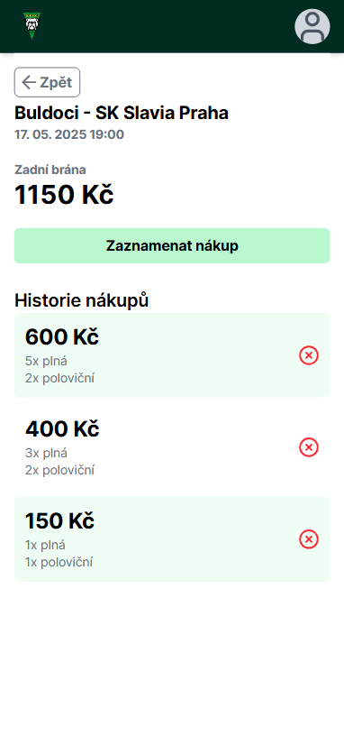
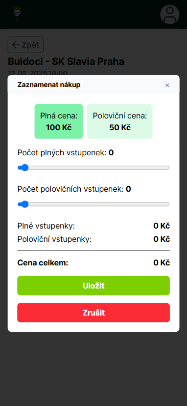
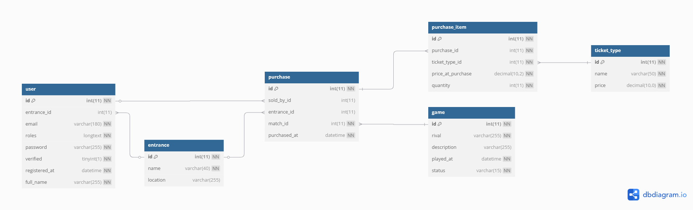

## O projektu

Nápad na tuto aplikaci mě napadl už pár let před jejím stvořením. Na jednom víkendovém domácím zápase karlovarského fotbalového klubu TJ Karlovy Vary-Dvory (neboli Buldoci) jsem musel zaskočit za svou sestru při vybírání vstupného. Po zjištění, že vstupenky se prodávají pomocí papírových šatnových bločků a zaznamenávají se jednoduše na kus papíru, mě napadlo, že by bylo možné celý proces zefektivnit, digitalizovat, ulehčit tak práci lidem, kteří vstupenky takovýmto způsobem prodávají a zajistit možnost sledování podrobných statistik z prodejů.

## Cíle

Cílem bylo vytvořit jednoduchý webový nástroj, který by umožnil:

- rychlejší a jednoduchý prodej vstupenek na mobilním zařízení pokladního,
- přehledné sledování tržeb a návštěvnosti,
- omamžité vyhodnocení prodejů ihned po jeho ukončení

## Budoucnost

Momentálně projekt prošel prvním testováním a vše zatím naznačuje tomu, že se aplikace od příští sezóny bude používat na všechn zápasech Buldoků. Před plným nasazením od srpna se bude muset doladit několik maličkostí, ale jako koncept aplikace uspěla a byla uvítána jako pozitivní vylepšení fungování klubu.

## Technologie

Front end aplikace je psaná v TypeScriptu a Reactu pomocí Vite. Pro styling aplikace jsem se rozhodl použít Tailwind, který mě už dlouho zajímal, ale poprvé jsem ho použil až u tohoto projektu.

Na backendu běží Symfony API. Se Symfony mám už nějaké zkušenosti a proto to byla jasná volba.

Front end a backend spolu komunikují pomocí REST API. Zabezpečení aplikace zajišťují JWT tokeny s délkou životnosti 2 hodiny. Do budoucna bych chtěl zabezpečení zlepšit pomocí refresh tokenů, ale pro momentální použití aplikace stačí samotné JWT tokens.

Pro vývojové prostředí jsem použil Docker a Docker Compose, který zajišťoval snadný vývoj bez větších starostí.

### Tech stack

#### Front end

- TypeScript,
- React 19,
- Tailwind
- Recharts
- React Router
- Vite,
- ESLint, Prettier,
- pnpm

#### Back end

- PHP 8.2,
- Symfony 7,
- MariaDB,
- Symfony Flex,
- Composer,
- Apache

#### Security

- JWT (LexikJWT)

#### Prostředí

- Docker,
- Docker Compose,
- Git,
- GitHub

#### Deploy

- Wedos NoLimit hosting

## Databázový diagram

