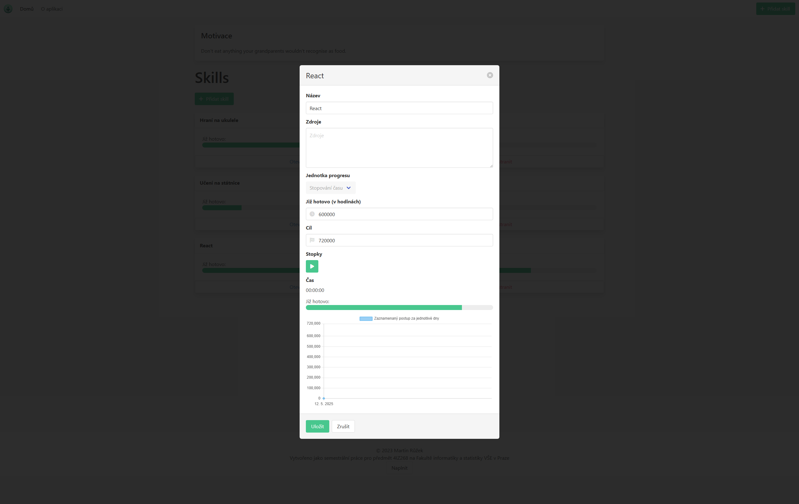

## O projektu

Velmi jednoduchá aplikace vytvořená v plain JavaScriptu, která vznikla jako druhá semestrální práce v předmětu Webové technologie na přelomu roku 2023 a 2024. Vytvoření této aplikace jsem vzal jako příležitost si po dlouhé době vytvořit takovou jednoduchou aplikaci v čistém JS.

Jejím účelem je dát uživateli možnost sledovat svůj pokrok v učení se jím stanovených schopnostech. Má na výběr z několika možností, jak své skilly trackovat:

1. Zaznamenávání procent
2. Zaznamenávání přečtených stran
3. Zaznamenávání uběhlého času stráveného učením se

## Cíle

Hlavním cílem bylo vytvořit intuitivní nástroj, který by uživateli umožnil:

- Jednoduše definovat nové dovednosti,
- Vybrat si preferovaný způsob záznamu pokroku pro každou dovednost,
- Přehledně sledovat aktuální stav a historii svého učení,
- Ukládat data lokálně v prohlížeči pro zachování kontinuity

## Technologie

Vzhledem k povaze projektu jako cvičení v základních webových technologiích je technologický stack velmi přímočarý:

### Frontend & Logika:

Celá logika aplikace je implementována v čistém JavaScriptu (ES6+). Uživatelské rozhraní je postaveno na sémantickém HTML5 a stylováno pomocí CSS3.

### Ukládání dat:

Pro perzistentní ukládání dat o definovaných dovednostech a zaznamenaném pokroku využívá aplikace LocalStorage API prohlížeče. To zajišťuje, že data zůstanou zachována i po zavření a opětovném otevření aplikace v témže prohlížeči.
